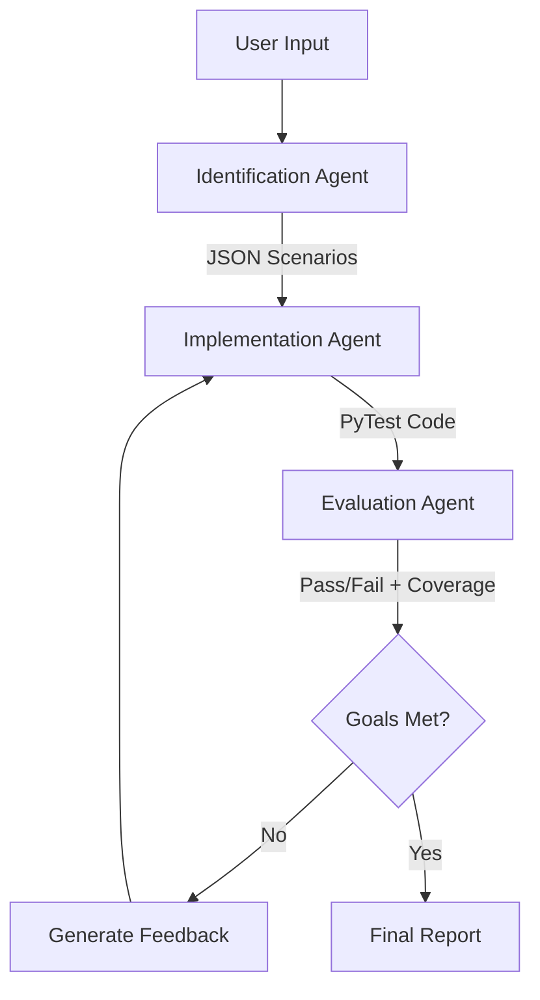

# 🕵️ Agentic Testing Pipeline

**An AI-powered automated testing ecosystem that autonomously identifies test scenarios, generates PyTest scripts, and evaluates code coverage & security.**

## 📖 Overview

The **Agentic Testing Pipeline** uses a multi-agent LLM architecture to ensure robust code quality. It doesn't just write tests; it intelligently explores your codebase to find edge cases, security vulnerabilities, and logic flows that standard tools miss.

### Key Features

- **🤖 Multi-Agent Architecture**:
  - **Identification Agent**: Scans code to find critical paths, edge cases, and security risks.
  - **Implementation Agent**: Writes production-ready `pytest` scripts.
  - **Evaluation Agent**: Runs tests, measures coverage (target 90%), and performs security analysis.
- **🛡️ Security-First**: Automatically detects SQL Injection, XSS, hardcoded secrets, and more.
- **📈 Self-Healing**: Iteratively improves tests until coverage and pass-rate goals are met.
- **🖥️ Multiple Interfaces**: Run via **GUI**, **REST API**, **CLI**, or **VS Code Extension**.

## 🏗️ Architecture

The system relies on a feedback loop between agents:



## 📂 Project Structure

- `src/extension/GUI`: **Desktop App** (CustomTkinter) for easy interaction.
- `src/extension/api`: **FastAPI Service** exposing agent capabilities over HTTP.
- `src/extension/pythonTestingPipeline`: **Core Logic** containing the agents and CLI tools.
- `src/extension/tools`: Helper utilities and shared resources.

## 🚀 Getting Started

### Prerequisites

- **Python**: 3.10+
- **API Keys**: `GROQ_API_KEY` (or OpenAI) added to your `.env` file.

### Installation

```bash
git clone https://github.com/galalqassas/autoAgenticTesting.git
cd autoAgenticTesting
python -m venv venv
.\venv\Scripts\activate  # Windows
pip install -r requirements.txt
```

### Environment Setup

1.  Copy `.env.example` to `.env`.
2.  Add your API keys:
    ```ini
    GROQ_API_KEY=gsk_...
    ```

## 🛠️ Usage Options

### 1. Graphical Interface (Recommended)

The most user-friendly way to run the pipeline.

**Steps:**

1.  **Run the GUI**:
    ```bash
    python src/extension/GUI/main.py
    ```
2.  **Select Target**: Click "Browse" or paste the path to your project directory.
3.  **Start**: Click the "Start Pipeline" button.
4.  **Monitor**: Watch the "Agent Flow" tab for real-time progress and "Console" for logs.
5.  **Review**: Check the "Report" tab for final results, coverage stats, and security findings.

### 2. REST API Server

Start the backend service to integrate with other tools or build your own UI.

```bash
python -m uvicorn src.extension.api.main:app --port 8000 --reload
```

**What you get:**

- **Interactive Docs**: Go to `http://localhost:8000/docs` to test endpoints.
- **Full Control**: Endpoints for individual agents (`/agents/identify`, `/agents/implement`), full pipeline runs (`/pipeline/run`), and utility functions.

### 3. Command Line Interface (CLI)

Best for CI/CD pipelines or power users who prefer the terminal.

```bash
python src/extension/pythonTestingPipeline/scripts/pythonTestingPipeline.py <target_directory> [options]
```

**Common Examples:**

- **Run with coverage**:
  ```bash
  python src/extension/pythonTestingPipeline/scripts/pythonTestingPipeline.py ./my_project --coverage
  ```
- **Auto-approve (No human in the loop)**:
  ```bash
  python src/extension/pythonTestingPipeline/scripts/pythonTestingPipeline.py ./my_project --auto-approve
  ```

### 4. VS Code Extension

### 4. VS Code Extension

Run the agentic testing pipeline directly within VS Code.

**Prerequisites:**

- Node.js (v18+)
- NPM

**Steps:**

1.  **Install Dependencies**:

    ```bash
    npm install

    # Compile the extension source code
    npm run compile
    ```

2.  **Launch Extension**:
    - Open the project in VS Code.
    - Press `F5` to start debugging. This opens a new "Extension Development Host" window.

3.  **Run Command**:
    - In the new window, open the Command Palette (`Ctrl+Shift+P` / `Cmd+Shift+P`).
    - Type and select: `Agentic Testing: Generate Tests`.
    - Follow the prompts to select your target codebase.
